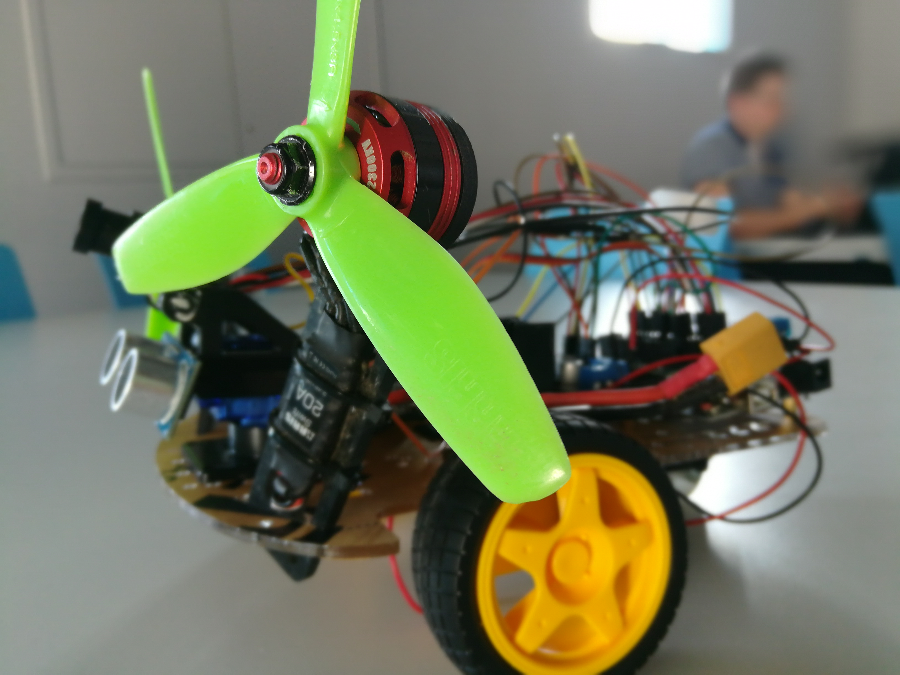
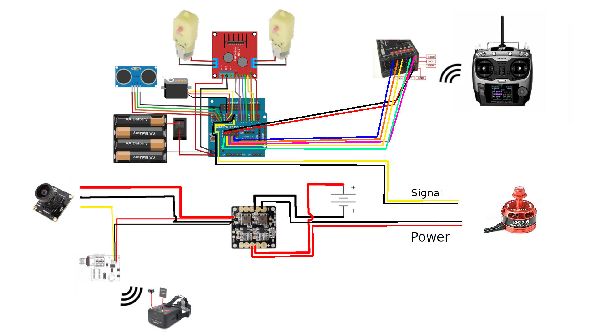

# Arduino Based RF controlled car

This project aim at creating a vehicule we can control using a RF controller. This was our end project for the IOT lessons we got at Ynov Campus.

This vehicule is composed of a lot of parts we listed in [this document](../doc/documentation.pdf)

The main parts are the following:

* [Smart Car Tracking Kit](https://www.ebay.co.uk/p/Smart-Car-Tracking-Motor-2wd-Kit-Ultrasonic-Hc-sr04-Sensor-for-Arduino-DIY-B3m8/17013379528) that contain an Arduino clone and a sensor-shield
* RadioLink AT9 controller/R9D receiver(any cheaper may do the job, we just had this one)
* AA battery (4 for the car, maybe more for the controller)

As you may see in the attached document, there were other parts, that are not vital but still fun like:

* A FPV system using a DAL 700 TVL with a TS5823S video emmiter with a compatible headset. This allow the user to pilot the car from quite far away even though he may not see the drone.

* A rotor system that should help the drone to gain speed and also drain battery a little  ¯\\_(ツ)_/¯

You can find the code for the fully handcontrolled prototype we made.

To make it work, follow the following diagram (taking what you want from it) and upload the code on the arduino:

We also used a [documentation](http://www.cs.columbia.edu/~sedwards/presentations/robot-car-instructions.pdf) for the car kit that may be kind of a great start. Some of our scheme are copied from it.

It was a lot of fun doing this, so we hope you'll enjoy it :D